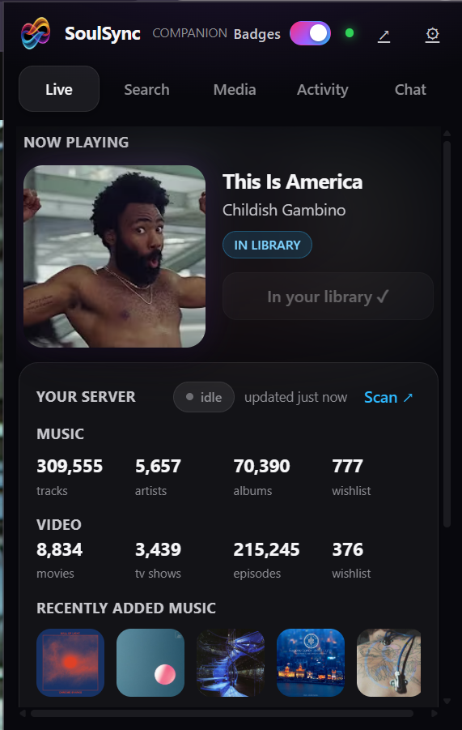
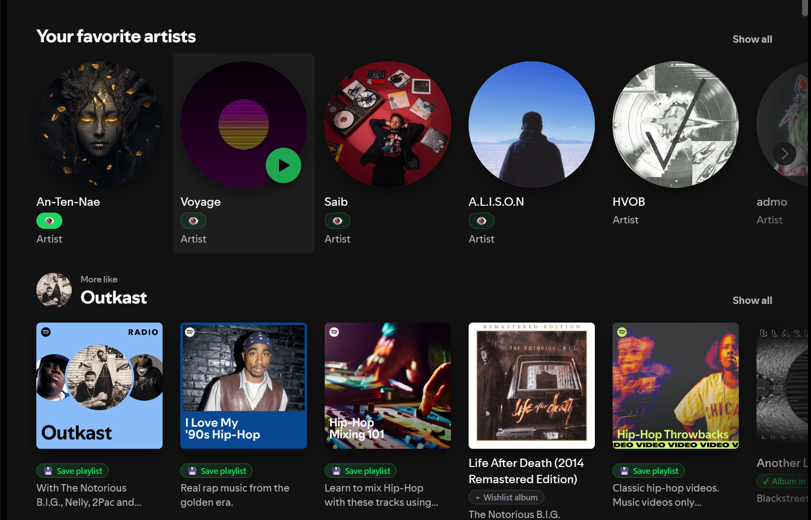
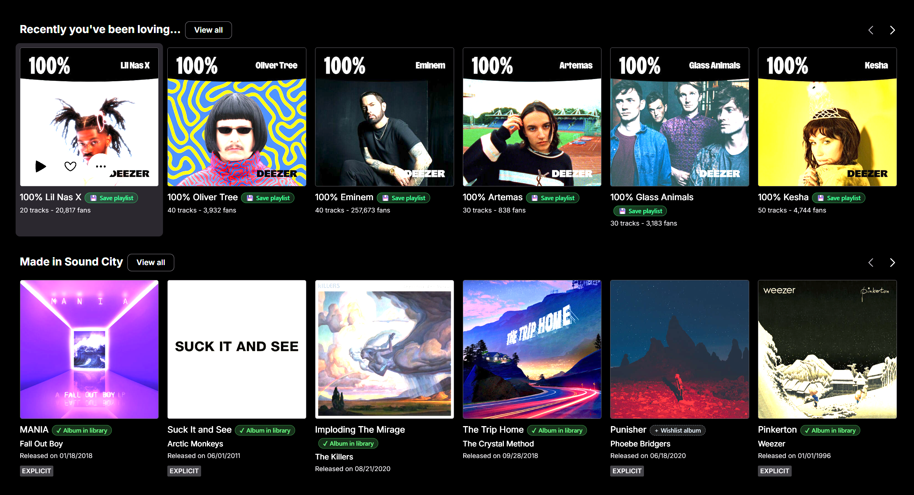
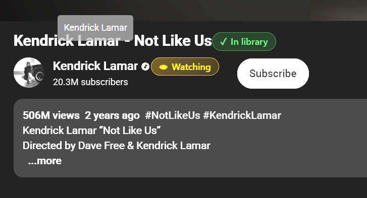
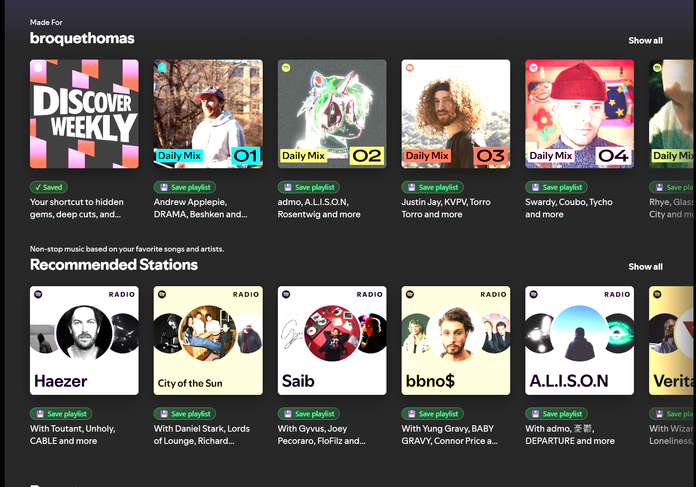

<h1 align="center">SoulSync Companion</h1>

<h3 align="center">Your SoulSync server, everywhere you browse music.</h3>

<p align="center">
  A browser extension for <a href="https://github.com/Nezreka/SoulSync">SoulSync</a> — the self-hosted home for your music. While you're browsing Spotify, Deezer, YouTube, Bandcamp, SoundCloud or Tidal, one click wishlists a track, watches an artist, or saves a whole playlist straight to your server.
</p>

<p align="center">
  <a href="https://github.com/Nezreka/soulsync-extension/releases"></a>
  <a href="https://discord.gg/wGvKqVQwmy"></a>
  <a href="https://ko-fi.com/boulderbadgedad"></a>
</p>

<p align="center">
  <a href="https://www.ssync.net/">Website</a> ·
  <a href="https://discord.gg/wGvKqVQwmy">Discord</a> ·
  <a href="https://github.com/Nezreka/SoulSync">SoulSync</a> ·
  <a href="#install">Install</a> ·
  <a href="https://github.com/Nezreka/soulsync-extension/issues">Issues</a>
</p>

<p align="center">
  
</p>

---

## Contents

- [Why Companion](#why-companion)
- [At a glance](#at-a-glance)
- [The popup](#the-popup) — Now Playing · Search · Activity
- [Page badges](#page-badges)
- [Save playlists](#save-playlists)
- [Right-click text import](#right-click-text-import)
- [Requirements](#requirements)
- [Install](#install)
- [How it works](#how-it-works)
- [Permissions — why each one](#permissions--why-each-one)
- [Privacy](#privacy)
- [Wishlist-only, by design](#wishlist-only-by-design)
- [Development](#development)
- [Troubleshooting](#troubleshooting)

---

## Why Companion

SoulSync already knows your library — what's in it, what's wishlisted, which artists you're watching. Companion puts that knowledge on the pages where you actually discover music, so you never have to wonder "do I already own this?" again.

- **It knows what you own.** Every pill on the page is checked against your real library. "In library" means in your library.
- **One click does the thing.** Wishlist a track, watch an artist, save a playlist — no modals, no confirmations, no second-guessing.
- **It's honest.** If a lookup fails, the pill says it couldn't verify instead of guessing. Unknown is never shown as absent.

## At a glance

| | |
|---|---|
| **Page badges** | Spotify, Deezer, YouTube, Bandcamp, SoundCloud, Tidal |
| **Playlist saving** | Spotify & Deezer — one click mirrors the playlist on your server |
| **Release pages** | Bandcamp & Beatport — send the whole release as one job |
| **Text import** | Paste `Artist - Title` lines, or right-click any text → Send to SoulSync |
| **Browsers** | Chrome 109+ / Firefox 121+, one Manifest V3 codebase |

---

## The popup

### Now Playing

Shows what the active tab is playing (read from the page's media session: title, artist, album, artwork). The Wishlist button is state-aware:

- track not in your library → **Wishlist**
- track already in your library → **In your library ✓** (disabled)
- track already wishlisted → **Remove from wishlist**

If the auto-match finds nothing, **Help match** opens a manual search with artwork so you can pick the right track. If a match looks wrong, **Not the right one?** opens the same picker.

Below that, the **Your server** card shows library stats (tracks / artists / albums / on-wishlist) and a **Recently added** albums rail.

The header carries a **Badges** toggle — page badges on or off, right there, persisted across restarts. On by default.

### Search

Manual track search across your metadata sources, with wishlist buttons on results. Below it, **Text import**: paste lines of `Artist - Title`, hit **Parse**, review the checkboxes, and send them to your **Wishlist** or into a **Playlist**. Lines that don't parse are flagged, never silently dropped.

### Activity

Server activity at the top (live sessions, play history, stats — the same data as the web UI's Server Activity drawer), plus the extension's own **Recent activity** feed: every wishlist, playlist import, and release send is recorded locally and survives popup closes.

---

## Page badges

On Spotify, Deezer, YouTube, Bandcamp, SoundCloud and Tidal, small pills next to artist, album and track names show your library and watchlist state. Badges appear as each lookup resolves — they don't wait for the whole page.

- **Artist pills** show watchlist state: **👁 Watching** or **👁 Add to Watchlist**. Adding is one click, no modal. Removing is a two-click inline verify (first click arms **✕ Remove?**, second removes).
- **Album and track pills** show **✓ In library**, **＋ Wishlist**, or **✓ Wishlisted**. Wishlist is one click, no popover; once wishlisted the pill is done — not clickable, no re-add, no remove.
- **Clicking a status pill opens its popover** with details, per-artist watchlist buttons, and **Open in SoulSync**, which deep-links to the exact artist page. Missing artists get an **Add to Watchlist** button styled like SoulSync's own — where the page URL carries the artist's ID (Spotify, Deezer) it's used directly, everywhere else the name is resolved through your server.
- **Multi-artist credits split up.** "Post Malone, Swae Lee" becomes two artists, each with their own watchlist button and state.
- **YouTube** gets artist pills on channel pages and artist + track pills on watch pages (`music.youtube.com` is excluded; there are no YouTube album badges). Video titles are parsed into artist and track — suffixes like "Official Video" are stripped — and if the artist can't be determined, a **🔍 manual search** pill lets you find and watch the artist by name, right in the popover.
- **Deezer album pages** resolve the exact tracklist through Deezer's public API via the album ID in the URL, so Wishlist works even though Deezer's page markup exposes no track titles.
- Spotify's media player gets a track pill only — no watchlist buttons there. Track rows never get artist badges.

<p align="center">
  <br>
  <em>Artist watchlist pills, playlist save pills, and album library pills on Spotify.</em>
</p>

<p align="center">
  <br>
  <em>Playlist save pills and album library pills on Deezer.</em>
</p>

<p align="center">
  <br>
  <em>Track and artist pills on a YouTube watch page.</em>
</p>

## Save playlists

Spotify and Deezer playlist cards and playlist pages get a **💾 Save playlist** pill. One click sends the playlist to SoulSync, which mirrors it and runs discovery. When it's saved the pill becomes **✓ Saved**; if it fails, **⚠ Save failed** shows the real error and clicks to retry. (Deezer's auto-generated smart tracklists are skipped — SoulSync can't resolve those URLs.)

<p align="center">
  <br>
  <em>Save playlist pills on Spotify playlist and radio cards.</em>
</p>

## Right-click text import

**Send to SoulSync** on any text selection drops the text into the popup's text-import view for review — parse, check, send to wishlist or playlist.

---

## Requirements

- A [SoulSync](https://github.com/Nezreka/SoulSync) server reachable from your browser.
- An API key, generated on the server's Settings page. The key acts with the admin profile's rights — treat it like a password.
- The server must send CORS headers for browser extensions (SoulSync [PR #1377](https://github.com/Nezreka/SoulSync/pull/1377), merged Sep 29, 2026). With an older server, Test connection fails with a network error even when the URL and key are correct.

## Install

```bash
npm install
npm run build      # -> dist/
```

- **Chrome:** `chrome://extensions` → Developer mode → Load unpacked → `dist/`
- **Firefox:** `about:debugging#/runtime/this-firefox` → Load Temporary Add-on → `dist/manifest.json` (temporary add-ons are removed when Firefox restarts)

Then open the popup, click the gear icon, enter your server URL and API key, and hit **Test connection**. Testing also asks the browser for permission to reach your server's host — grant it, or no server calls will work.

Prebuilt zips: `npm run package` produces `soulsync-extension-<version>-chrome.zip` and `-firefox.zip` at the repo root (gitignored).

---

## How it works

```
src/
  manifest.json          MV3, one codebase for Chrome 109+ / Firefox 121+
  background/
    service-worker.ts    context menu, message hub — all badge actions go through it
  content/
    media-session.ts     reads navigator.mediaSession.metadata on music sites
    bandcamp.ts          release extractor (JSON-LD → og: tags → DOM)
    beatport.ts          release extractor (same strategy)
    page-badges.ts       library-status pills, watchlist, wishlist, playlist saving
  popup/
    popup.ts/html/css    Now Playing · Search · Activity tabs, Badges toggle
    activity.ts          server activity view (sessions / history / stats)
  options/               server URL + API key + test connection
  shared/
    api.ts               typed SoulSync v1 client
    server-activity.ts   typed client for /api/server-activity
    parse.ts             "Artist - Title" line parser
    youtube.ts           video-title parsing, artist splitting
    provider_ids.ts      native provider ID extraction
    dom.ts               JSON-LD / meta-tag helpers for extractors
  icons/
```

- The popup calls the SoulSync API directly from the extension context (`shared/api.ts`, `shared/server-activity.ts`). That's why the server has to send CORS headers for extensions (PR #1377) — without them the browser blocks the popup's requests.
- The background worker owns the "Send to SoulSync" context menu and relays badge actions from content scripts (artist resolve, watch-artist, wishlist, save-playlist), so page scripts never touch the API key or the network.
- Content scripts only report page state: media-session metadata, release metadata, badge candidates.
- Auth is `Authorization: Bearer <key>` on `/api/v1/*` routes. A few non-v1 routes (watchlist add, image URLs) carry the key as `?api_key=` instead, because `` requests carry no headers.
- Artwork is routed through the server (`/api/image-cache/…` or `/api/image-proxy?url=…`), mirroring the web UI — the extension never fetches remote images directly. Anything that still fails degrades to a gradient placeholder; broken-image icons are never shown.
- The server URL, API key, badges toggle, and recent-activity feed live in `chrome.storage.local` only. They never leave the machine except in requests to the server you configured.

## Permissions — why each one

- `storage` — server URL, API key, badges toggle, and the recent-activity feed.
- `contextMenus` — the "Send to SoulSync" item on text selections.
- `activeTab` — lets the popup ask the active tab for its media-session metadata when it opens.
- `scripting` — declared in the manifest; currently unused by any code path.
- `optional_host_permissions` (`http://*/*`, `https://*/*`) — granted at setup via Test connection so the extension can reach your server. No `<all_urls>` content-script access: content scripts run only on the explicit music-site list (YouTube, Spotify, SoundCloud, Deezer, Tidal, Bandcamp, Beatport).
- `host_permissions` (`https://api.deezer.com/*`) — Deezer's public API, used to resolve exact album tracklists on Deezer album pages.
- The Firefox build declares `data_collection_permissions: ["none"]`.

## Privacy

No telemetry, no analytics, no remote code, no audio capture. The extension talks to exactly one server — yours.

## Wishlist-only, by design

The extension never triggers downloads directly. Wishlist adds are the download path: SoulSync's wishlist pipeline downloads and imports them automatically. A direct Download button was deliberately cut (it bypassed the server's download blocklist).

## Development

```bash
npm install
npm run typecheck  # tsc --noEmit
npm run build      # esbuild bundles -> dist/, manifest version synced from package.json
npm run package    # build + zips for Chrome / Firefox
```

TypeScript + esbuild, no framework. `webextension-polyfill` for the `browser.*` namespace on both browsers. The background service worker stays a real ES module (MV3 requirement); content scripts and UI scripts are self-contained IIFE bundles.

More detail: [docs/SPEC.md](docs/SPEC.md) (behavior spec), [docs/SERVER_ENDPOINTS.md](docs/SERVER_ENDPOINTS.md) (verified server API contract), [docs/TESTING.md](docs/TESTING.md) (manual test checklist).

## Troubleshooting

- **Test connection fails with a network error:** check the URL (scheme + port, e.g. `http://192.168.1.10:8080`), the API key, and that the server is reachable from this machine. In Firefox, a `NetworkError` with correct credentials usually means the server predates the extension CORS support (PR #1377) — the server sends no CORS headers, so the browser blocks the request before auth is even checked.
- **"This page isn't reporting anything via its media session":** the page exposes no media metadata (common on non-player pages). The extension says so plainly instead of guessing from the tab title.
- **Firefox forgot the extension after restart:** expected — temporary add-ons don't survive restarts. Reinstall from `dist/` or use the packaged zip.

---

Companion is the browsing half of [SoulSync](https://github.com/Nezreka/SoulSync) — the self-hosted home for your music. If it saves you time, consider [supporting SoulSync on Ko-fi](https://ko-fi.com/boulderbadgedad). For help, [Discord](https://discord.gg/wGvKqVQwmy) is fastest, and there's more at [ssync.net](https://www.ssync.net/).
